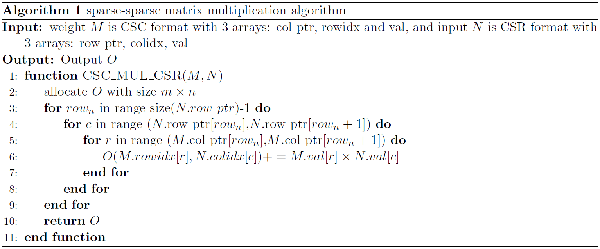
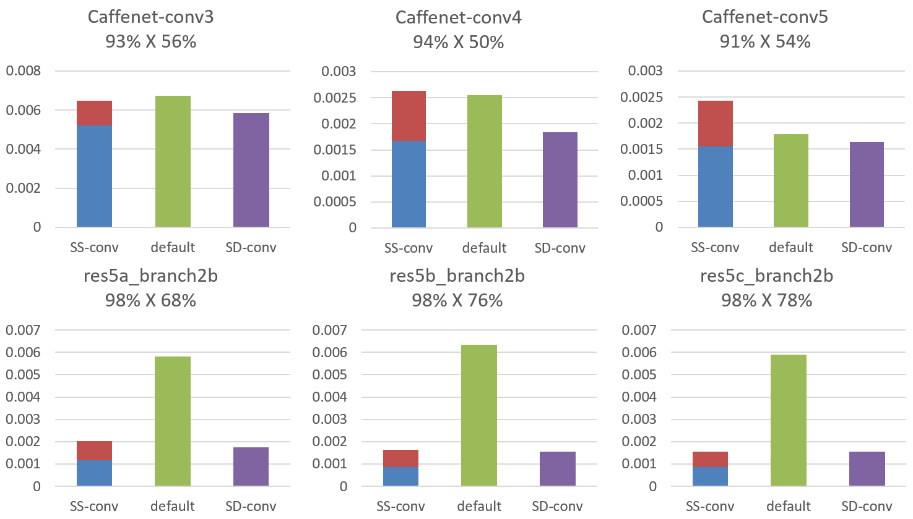

# Speed Up Neural Network Inference
In this work, I implement Sparse-sparse Convolution in caffe, and test it with some famous neural network to see the acceleration.  
The experimental result shows that  this  method  leads  to  good  speedup  for  some  layers  with  sparse  inputs  and  weights
compared  to  traditional  convolution  method,  and  can  reach  the  speed  of  Sparse-matrix-dense-matrix  Multiplication(SpMDM), 
which  is  the  state  of  the  art  speedup  now.   To reduce matrix format conversion penalty, I modify this algorithm and proposed 
an algorithm which outputs matrix in sparse format.

## Usage
Replace the caffe/src/caffe/layers/base_conv_layer.cpp file with my modified file and re-compile caffe.

## Algorithm

## Result
We have implemented the Sparse-sparse Convolution in caffe interface and test the speedup on some convolution layers of 
Caffenet and Resnet50. The trained weights can be easily download at [SkimCaffe](https://github.com/IntelLabs/SkimCaffe). 
The test input are 1000 images download at ImageNet of 20 different classes. The test is done on Ubuntu18.04 with CPU Intel Core i5-8250U. 
The result of Caffenet and Resnet-50 are shown below. The red cylinder part represents the time of converting input matrix to CSR format, 
and the blue cylinder part represents the time of Sparse-sparse Matrix Multiplication. The green cylinder represents the origin time of 
default convolution. The purple cylinder represents the time of SpMDM.

From the result we can find:
*Different  layer  architecture  consult  in  different  speed  in  Sparse-sparse  Convolution. The higher the ratio of weight size to input size, the faster the compute.
*Cause the large input size and low sparsity of Caffenet convolution layers, the algorithm even slows down the convolution.  The penalty of input2CSR stunts the performance.
*Sparse-sparse Convolution achieves good speed up on the last few layers of Resnet-50. Cause the network is deep enough, the input matrices reach high sparsity. The speedup reaches  2.92×∼3.88×,  which  is  similar  to  the  state-of-art  speed.  However,  the  input2CSR part is still a big penalty.